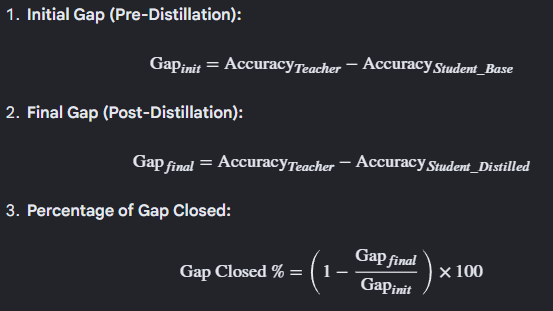

# Knowledge Distillation: A Complete Guide

**Project:** Distilling a ResNet-56 teacher into a ResNet-20 student on CIFAR-100.
**Goal:** Build deep intuition for every concept — no hand-waving, no skipped nuances.

---

## Table of Contents

- [Knowledge Distillation: A Complete Guide](#knowledge-distillation-a-complete-guide)
  - [Table of Contents](#table-of-contents)
  - [1. What is Knowledge Distillation?](#1-what-is-knowledge-distillation)
  - [2. The Core Intuition: "Dark Knowledge"](#2-the-core-intuition-dark-knowledge)
  - [3. The Three Flavors of Distillation](#3-the-three-flavors-of-distillation)
    - [3.1 Response-based (logit) distillation](#31-response-based-logit-distillation)
    - [3.2 Feature-based distillation](#32-feature-based-distillation)
    - [3.3 Relation-based distillation](#33-relation-based-distillation)
  - [4. The Dataset: CIFAR-100](#4-the-dataset-cifar-100)
    - [4.1 What it is](#41-what-it-is)
    - [4.2 Normalization](#42-normalization)
    - [4.3 Data augmentation](#43-data-augmentation)
  - [5. The Models: ResNet-56 and ResNet-20](#5-the-models-resnet-56-and-resnet-20)
    - [5.1 Why ResNet at all?](#51-why-resnet-at-all)
    - [5.2 CIFAR ResNet architecture](#52-cifar-resnet-architecture)
    - [5.3 Exposing intermediate features](#53-exposing-intermediate-features)
  - [6. Soft-Label Distillation — The Math](#6-soft-label-distillation--the-math)
    - [6.1 Temperature scaling, step by step](#61-temperature-scaling-step-by-step)
    - [6.2 The KL divergence loss](#62-the-kl-divergence-loss)
    - [6.3 The T² rescaling factor](#63-the-t-rescaling-factor)
    - [6.4 Code](#64-code)
  - [7. Feature-Based Distillation — The Math](#7-feature-based-distillation--the-math)
    - [7.1 Motivation](#71-motivation)
    - [7.2 The basic loss](#72-the-basic-loss)
    - [7.3 The adaptation layer](#73-the-adaptation-layer)
    - [7.4 L2 normalization before MSE](#74-l2-normalization-before-mse)
    - [7.5 Detaching the teacher](#75-detaching-the-teacher)
    - [7.6 Which layers to match?](#76-which-layers-to-match)
  - [8. The Combined Loss](#8-the-combined-loss)
  - [9. Hyperparameters: Temperature, Alpha, Beta](#9-hyperparameters-temperature-alpha-beta)
    - [9.1 Temperature (T)](#91-temperature-t)
    - [9.2 Alpha (α)](#92-alpha-α)
    - [9.3 Beta (β)](#93-beta-β)
    - [9.4 Suggested sweep for experimentation](#94-suggested-sweep-for-experimentation)
  - [10. Training Pipeline Overview](#10-training-pipeline-overview)
  - [11. One-Time Modal Setup](#11-one-time-modal-setup)
  - [12. Phase 1: Train the Teacher](#12-phase-1-train-the-teacher)
    - [12.1 What's happening under the hood](#121-whats-happening-under-the-hood)
    - [12.2 Expected output](#122-expected-output)
  - [13. Phase 2: Train the Baseline Student](#13-phase-2-train-the-baseline-student)
  - [14. Phase 3: Distillation Training](#14-phase-3-distillation-training)
    - [14.1 What's happening](#141-whats-happening)
    - [14.2 Expected output](#142-expected-output)
  - [15. Phase 4: Evaluation and Comparison](#15-phase-4-evaluation-and-comparison)
    - [15.1 What it measures](#151-what-it-measures)
    - [15.2 Actual output](#152-actual-output)
  - [16. Ablation Sweeps](#16-ablation-sweeps)
  - [17. Downloading and Inspecting Results](#17-downloading-and-inspecting-results)
    - [17.1 List what's on the volume](#171-list-whats-on-the-volume)
    - [17.2 Download a checkpoint locally](#172-download-a-checkpoint-locally)
    - [17.3 Download training logs](#173-download-training-logs)
    - [17.4 Clean up](#174-clean-up)
  - [18. Results](#18-results)
  - [19. Inference](#19-inference)
  - [20. Common Pitfalls and Gotchas](#20-common-pitfalls-and-gotchas)
  - [21. Extensions and Next Steps](#21-extensions-and-next-steps)
    - [21.1 Different teachers](#211-different-teachers)
    - [21.2 Different students](#212-different-students)
    - [21.3 Heterogeneous teacher/student](#213-heterogeneous-teacherstudent)
    - [21.4 Self-distillation](#214-self-distillation)
    - [21.5 Ensemble distillation](#215-ensemble-distillation)
    - [21.6 Advanced KD losses](#216-advanced-kd-losses)
    - [21.7 Quantization after distillation](#217-quantization-after-distillation)
    - [21.8 Move to ImageNet](#218-move-to-imagenet)
  - [File index](#file-index)
  - [Quick reference: every command you'll ever type](#quick-reference-every-command-youll-ever-type)

---

## 1. What is Knowledge Distillation?

**Knowledge distillation (KD)** is a model compression technique where a small "student" model is trained to mimic a larger, pretrained "teacher" model. The goal is to get most of the teacher's accuracy in a fraction of the size.

The original paper is Hinton, Vinyals, and Dean (2015), *"Distilling the Knowledge in a Neural Network"*. Before this, compressing neural networks meant pruning, quantization, or low-rank factorization — all of which operate on the weights directly. Hinton's insight was that you can instead train a new, smaller network from scratch using the predictions of a larger one as a richer training signal than raw labels.


**Why does it work?** Because the teacher's output contains more information than the raw label. That's the whole trick. Let's unpack it.

---

## 2. The Core Intuition: "Dark Knowledge"

Imagine you're training an image classifier on CIFAR-100, and the image is a tiger. Here's what a trained teacher produces vs what the dataset says:

```
Dataset label (one-hot):
    tiger:   1.0
    leopard: 0.0
    lion:    0.0
    truck:   0.0
    ... all other 96 classes: 0.0

Teacher's softmax output:
    tiger:   0.75
    leopard: 0.15
    lion:    0.08
    cat:     0.01
    truck:   1e-9
    ... etc
```

The dataset tells you only "this is a tiger". The teacher tells you "it's a tiger, and it looks somewhat like a leopard, a bit like a lion, a tiny bit like a cat, and nothing like a truck". That extra structure — the **relative probabilities across wrong classes** — is called **dark knowledge**. It's the teacher's learned model of how classes relate to each other.

Training on one-hot labels throws this information away. Training on the teacher's soft distribution keeps it. A student that learns "tiger is more similar to leopard than to truck" develops richer internal representations, and generalizes better, even though its capacity is small.

**This is the single most important concept in the entire project.** Everything else is mechanics.

There's one problem though: at the default softmax, the probability of the correct class is usually very high (e.g., 0.97), and the others are crushed near zero. The dark knowledge is technically there, but numerically hidden. **Temperature scaling** solves this — see section 6.

---

## 3. The Three Flavors of Distillation

The KD literature broadly splits into three families based on *what* you match between teacher and student:

### 3.1 Response-based (logit) distillation
Match the final output layer. This is Hinton's original formulation. You compare the teacher's and student's softened softmax outputs.
- **Pros:** Simple. Works with any two models that have the same number of output classes.
- **Cons:** Only uses the final layer. Ignores everything the teacher learned internally.
- **Use when:** You want a clean baseline, or when teacher and student have very different architectures.

### 3.2 Feature-based distillation
Match intermediate activations. Introduced by FitNets (Romero et al., 2015). You pick a few "hint" layers in the teacher and matching "guided" layers in the student, and you force the student's activations at those points to approximate the teacher's.
- **Pros:** Much richer signal. The student must learn teacher-like internal representations, not just the same final answers.
- **Cons:** Requires choosing which layers to match. Needs adaptation layers if teacher and student dimensions differ.
- **Use when:** You want maximum gap closure and the teacher/student are structurally similar.

### 3.3 Relation-based distillation
Match *relationships* between examples. For instance: "in the teacher's feature space, example A is closer to B than to C — student, please preserve that relationship." Examples include RKD (Park et al., 2019) and CRD (Tian et al., 2020).
- **Pros:** Captures higher-order structure. Often state-of-the-art.
- **Cons:** More complex. Harder to tune. We don't cover this in the code.

**This project uses both response-based AND feature-based distillation, combined.** That's the best trade-off between simplicity and performance for educational purposes.

---

## 4. The Dataset: CIFAR-100

### 4.1 What it is

**CIFAR-100** is a 100-class image classification dataset created by Alex Krizhevsky at the University of Toronto. It contains:

- **60,000 color images** at **32×32 pixel** resolution
- **100 classes**, with 600 images per class
- **50,000 training images** (500 per class)
- **10,000 test images** (100 per class)
- Classes are also organized into **20 superclasses** (e.g., "aquatic mammals" contains beaver, dolphin, otter, seal, whale), though we ignore the hierarchy for this project
- Downloaded automatically via `torchvision.datasets.CIFAR100` (~170 MB)


### 4.2 Normalization

We normalize images using per-channel mean and standard deviation computed on the CIFAR-100 training set:

```python
CIFAR100_MEAN = (0.5071, 0.4865, 0.4409)
CIFAR100_STD  = (0.2673, 0.2564, 0.2762)
```

This centers and scales the inputs so the first convolution sees well-conditioned data. Without it, convergence is slower and final accuracy is lower by 1-2%.

### 4.3 Data augmentation

We apply the standard CIFAR augmentation recipe to the **training set only**:

1. **Random crop with 4px padding.** Pad the 32×32 image to 40×40, then crop a random 32×32 patch. This simulates small spatial translations and prevents overfitting to exact pixel positions.
2. **Random horizontal flip.** With 50% probability, mirror the image left-right. Most CIFAR classes are mirror-symmetric (a flipped cat is still a cat), so this doubles the effective training set.
3. **ToTensor + Normalize.** Convert PIL image to `[0,1]` float tensor, then subtract mean and divide by std.

The test set gets only ToTensor + Normalize — no augmentation. We evaluate on the real images.

---

## 5. The Models: ResNet-56 and ResNet-20

### 5.1 Why ResNet at all?

ResNets (He et al., 2016) solved the "degradation problem" in deep networks: as you stack more layers, training accuracy eventually *gets worse*, not better. The fix is the **residual connection**:

```
    x ──┬──[F(x)]──(+)── out
        └──────────┘
```

Instead of learning the full mapping `y = H(x)`, each block learns a residual `F(x) = H(x) - x`, and then adds the input back: `y = F(x) + x`. This has two benefits:

1. **Gradient flow.** In backprop, the skip connection gives gradients a direct path back to earlier layers, preventing the vanishing gradient problem that plagued deep plain networks.
2. **Identity initialization.** If you initialize `F` near zero, the block starts as an identity function, which is a sensible prior — worst case, the block does nothing.

This means you can stack hundreds of layers and they actually *help*.

### 5.2 CIFAR ResNet architecture

CIFAR ResNets are slightly different from ImageNet ResNets because of the tiny 32×32 input. The ImageNet version has a 7×7 stride-2 stem conv that would destroy most spatial information on CIFAR, so we use a 3×3 stride-1 stem instead.

The structure is:

```
Stem: 3×3 conv → BN → ReLU           [B, 3, 32, 32]  → [B, 16, 32, 32]

Stage 1: N residual blocks, 16ch      [B, 16, 32, 32] → [B, 16, 32, 32]
Stage 2: N residual blocks, 32ch      [B, 16, 32, 32] → [B, 32, 16, 16]  (first block has stride 2)
Stage 3: N residual blocks, 64ch      [B, 32, 16, 16] → [B, 64,  8,  8]  (first block has stride 2)

Global average pool                   [B, 64,  8,  8] → [B, 64]
Linear classifier                     [B, 64]         → [B, 100]
```

Total depth = 6N + 2 layers (each block has 2 convs, plus stem and fc).

| Model | N | Depth | Params | 
|-------|---|-------|--------|
| ResNet-20 | 3 | 20 | 278,324 | 
| ResNet-56 | 9 | 56 | 861,620 | 

**Compression ratio: 3.10×** (teacher params / student params).


### 5.3 Exposing intermediate features

Both models have a forward mode that returns not just the final logits but also the intermediate feature maps after each stage:

```python
logits, features = model(x, return_features=True)
#                      features = [f1, f2, f3]
#                      f1: [B, 16, 32, 32] — after stage 1
#                      f2: [B, 32, 16, 16] — after stage 2
#                      f3: [B, 64,  8,  8] — after stage 3
```

We use these for feature-based distillation. 

---

## 6. Soft-Label Distillation — The Math

### 6.1 Temperature scaling, step by step

Start with the teacher's logits — the raw pre-softmax outputs. Call them `z_T`. The normal softmax is:

```
        exp(z_T_i)
p_i = ─────────────────
      Σ_j exp(z_T_j)
```

For a confident teacher, one `p_i` is near 1 and the rest are near 0. The dark knowledge is there (the zero probabilities aren't exactly zero), but it's numerically tiny.

Now introduce a **temperature** `T > 0` and compute the softmax on `z_T / T` instead:

```
             exp(z_T_i / T)
p_i(T) = ─────────────────────
         Σ_j exp(z_T_j / T)
```

What happens as `T` varies?

- **T = 1:** Normal softmax. Peaked.
- **T → 0:** Distribution collapses to argmax (one-hot).
- **T → ∞:** Distribution approaches uniform (`1/num_classes` for every class).
- **T = 4 (typical):** Distribution is meaningfully softened but still has structure — the correct class is still the most likely, but the similarity between related wrong classes becomes visible.

**Intuition:** temperature is a magnifying glass on the low-probability region. Higher `T` makes the teacher's opinions about "which wrong classes look most similar" more visible to the student.

### 6.2 The KL divergence loss

Now we want the student's softened output to match the teacher's softened output. The natural measure of how far one probability distribution is from another is **KL divergence**:

```
KL(p_T || p_S) = Σ_i  p_T_i · log( p_T_i / p_S_i )
```

This is **asymmetric** — `KL(A||B) ≠ KL(B||A)`. The convention in distillation (and originally in Hinton's paper) is to put the teacher as the *target* distribution (the first argument) and the student as the *approximation*. Intuitively: the teacher says "here is the truth I learned", and the student must approximate that truth.

In PyTorch, `F.kl_div(log_p, q, reduction='batchmean')` computes `Σ q · (log q - log_p)`, which equals `KL(q || exp(log_p))`. The arguments are **log-probs for the student (input)** and **probs for the teacher (target)**. Getting them backwards is a silent bug. The code handles this explicitly.

### 6.3 The T² rescaling factor

Here's the subtlety Hinton pointed out. When you compute gradients of the KL loss with respect to the student logits, the derivative of `softmax(z/T)` with respect to `z` contains a factor of `1/T`. And since KL divergence involves the log of the softmax, another `1/T` comes from the chain rule. Net result: gradient magnitudes from the distillation loss scale as `1/T²`.

This means if you naively use a higher temperature to expose more dark knowledge, you also reduce the effective learning rate of the KD loss by `T²`. If you then combine KD with a hard-label loss using `L = (1-α)·L_CE + α·L_KD`, the KD contribution becomes tiny at high `T`, and you'd have to re-tune `α` every time you change `T`.

The fix is to multiply the KD loss by `T²`:

```
L_KD = T² · KL(softmax(z_T/T) || softmax(z_S/T))
```

Now the gradients are roughly independent of `T`, and you can tune `α` once and change `T` freely. **This is why every distillation implementation you see has that mysterious `T**2` factor.** It's not optional — forgetting it will make high temperatures silently useless.

### 6.4 Code

```python
class SoftLabelKDLoss(nn.Module):
    def __init__(self, temperature: float = 4.0):
        super().__init__()
        self.T = temperature

    def forward(self, student_logits, teacher_logits):
        log_p_student = F.log_softmax(student_logits / self.T, dim=-1)
        p_teacher     = F.softmax(teacher_logits / self.T, dim=-1)
        kl = F.kl_div(log_p_student, p_teacher, reduction="batchmean")
        return kl * (self.T ** 2)
```

Three things to notice:
- `log_softmax` (not `log(softmax)`) for numerical stability
- `batchmean` reduction (sums over classes, averages over batch) — this matches the theoretical KL formula
- The `T²` factor at the end

---

## 7. Feature-Based Distillation — The Math

### 7.1 Motivation

Soft-label KD gives the student a richer target, but it's still only a *final-layer* signal. The student is free to reach the same output via completely different internal representations. Feature-based distillation addresses this by forcing the student's intermediate activations to resemble the teacher's.

Think of it like tutoring: soft labels say "here's the answer key with partial credit information". Feature matching says "and here's how I would have solved the problem — follow my work". The latter is a much stronger signal.

### 7.2 The basic loss

For each stage `s`, pick the feature map from the teacher `F_T^s` and the corresponding one from the student `F_S^s`. The loss is:

```
L_feat_s = MSE( normalize(adapt(F_S^s)), normalize(F_T^s.detach()) )
```

And the total feature loss is the mean over stages:

```
L_feat = (1/num_stages) · Σ_s L_feat_s
```

Let me unpack each piece.

### 7.3 The adaptation layer

If the teacher and student have different channel counts at stage `s`, you can't directly compare their feature tensors (they're different shapes). The fix is a learned 1×1 convolution that projects the student's features to the teacher's channel dim:

```python
adapt = nn.Conv2d(student_channels_s, teacher_channels_s, kernel_size=1, bias=False)
```

A 1×1 conv is just a learned linear combination of channels at each spatial position — the cheapest possible way to reshape a feature tensor. We add a BatchNorm after it for training stability.

**In our specific case**, both ResNet-20 and ResNet-56 use `[16, 32, 64]` channels per stage, so the adaptation layer reduces to `nn.Identity`. But we build the general case so the code works with any teacher/student pair.

**Note:** adaptation layers have their own parameters. They must be registered with the optimizer alongside the student's parameters, or they'll never get updated. The training script handles this explicitly:

```python
trainable_params = list(student.parameters()) + list(loss_fn.parameters())
optimizer = optim.SGD(trainable_params, ...)
```

### 7.4 L2 normalization before MSE

We L2-normalize each feature vector (along the channel axis) before computing MSE:

```python
s_norm = F.normalize(s_adapted, p=2, dim=1)
t_norm = F.normalize(t_feat.detach(), p=2, dim=1)
loss = F.mse_loss(s_norm, t_norm)
```

**Why?** Without normalization, the loss would reward the student for producing features with the same *magnitude* as the teacher. But magnitude is arbitrary — it depends on weight norms, which don't necessarily reflect useful information. What actually matters is the *direction* of the feature vector (which channel is most active, in what pattern). L2 normalization projects each feature vector to the unit hypersphere, making the MSE loss measure angular distance instead of Euclidean distance. The student is no longer penalized for having smaller weight norms than the teacher.

This is a small but important detail. Many naive implementations skip it and end up with feature losses that are dominated by scale mismatch.

### 7.5 Detaching the teacher

Notice the `.detach()` on the teacher features:

```python
t_norm = F.normalize(t_feat.detach(), p=2, dim=1)
```

This is **critical**. Without it:

- PyTorch would compute gradients through the teacher during backprop
- The teacher would either get updated (bad — it's supposed to be frozen), or
- Autograd would error because the teacher's BatchNorm is in eval mode, or
- Best case, you'd waste memory storing a computational graph through a model whose weights you don't want to touch

`.detach()` severs the computational graph at this tensor. The teacher features become "constants" from autograd's perspective, exactly what we want.

Belt and suspenders: the training loop also wraps the teacher forward pass in `with torch.no_grad():`, which prevents the graph from being built in the first place. Both mechanisms protect against accidental teacher updates.

### 7.6 Which layers to match?

For our ResNets, the obvious choice is the end of each stage (three feature maps total). This gives us:
- Shallow features (stage 1): low-level textures, edges
- Mid-level features (stage 2): parts, local patterns
- Deep features (stage 3): high-level semantic structure

Matching all three stages spans the full hierarchy. If you only matched the deepest stage, you'd miss out on the early "how to see" signal. If you only matched the shallow stage, the student would learn teacher-like textures but not teacher-like concepts.

**Rule of thumb for other architectures:** pick 3-4 layers roughly evenly distributed through the network, avoiding the very first layer (which is just raw edges) and the very last layer (since soft-label KD already handles that).

---

## 8. The Combined Loss

Putting it all together, the total distillation loss is:

```
L_total = (1 - α) · L_CE  +  α · L_KD  +  β · L_feat
```

- `L_CE`: standard cross-entropy on the true labels (anchoring signal)
- `L_KD`: soft-label KD loss with temperature (dark knowledge signal)
- `L_feat`: feature-matching loss (internal representation signal)
- `α ∈ [0, 1]`: balance between hard and soft labels
- `β ≥ 0`: weight on feature matching

**Why keep `L_CE` at all?** Couldn't we just use KD? In principle yes, but in practice the ground-truth labels provide a useful "anchor" that prevents the student from drifting into bad regions where it confidently imitates teacher mistakes. Even when the teacher is wrong (and it will be — ResNet-56 on CIFAR-100 is only ~72% accurate), the hard label keeps the student grounded.

**Why separate `α` on KD but `β` standalone on feat?** Because feat loss is on a completely different scale (L2-normalized MSE produces values in 0-2 range), so `β` needs room to grow into values like 100 or 1000 without disrupting the `α` balance between CE and KD.

The `DistillationLoss` module implements this whole thing and returns both the combined scalar and a dict of individual component values for logging.

---

## 9. Hyperparameters: Temperature, Alpha, Beta

These three knobs determine everything. Getting them right matters.

### 9.1 Temperature (T)

**What it does:** softens the teacher's probability distribution.

**Typical range:** 2 to 10. Our default is 4.

**How to pick it:**
- **Start at T = 4.** This is the modal value across hundreds of distillation papers.
- **If the teacher is very confident** (logits very peaked, e.g., very well-trained model), try higher T (6-10) to reveal more dark knowledge.
- **If the teacher is poorly trained or has high entropy already**, try lower T (2-3).
- Too high (T = 20+) makes the distribution nearly uniform, and you lose the signal you wanted.
- Too low (T = 1) means no softening at all, and dark knowledge stays hidden.

**How to diagnose it:** if your KD loss is huge (say, 50+) throughout training, T might be too low — the teacher distribution is so peaked that the student has little hope of matching it. If your KD loss is tiny (< 0.1) and stays flat, T might be too high.

### 9.2 Alpha (α)

**What it does:** balances hard-label loss vs soft-label KD loss.

**Typical range:** 0.5 to 0.9. Our default is 0.7.

**How to pick it:**
- **High α (0.7-0.9) works best when the teacher is good.** The teacher's soft labels contain more information than the hard labels, so weight them more.
- **Low α (0.3-0.5)** is safer if you're not sure about teacher quality — it gives hard labels more influence.
- **α = 0** disables KD entirely (pure CE training = baseline student).
- **α = 1** removes the hard label. This is risky because the student has no ground-truth anchor.

Hinton's original paper found α around 0.9 worked best for their setup. Modern distillation work tends to use 0.5-0.7.

### 9.3 Beta (β)

**What it does:** weights the feature-matching loss.

**Typical range:** 10 to 1000. Our default is 100.

**Why such a big number?** Because L2-normalized MSE over high-dimensional feature maps produces very small values (often 0.01 - 0.1). Without a large coefficient, feature loss contributes nothing to gradients.

**How to pick it:** run one short distillation with `β = 0` (logit KD only) and check the `feat` loss value in the logs anyway. You'll see it at maybe 0.05. Pick `β` such that `β · feat ≈ α · KD` at the start of training. With our defaults and an untrained student, `β ≈ 100` puts feat at roughly the same magnitude as KD.

**Diagnostic:** in the training log, watch `β · feat` (the contribution to total loss, not just raw feat). It should be in the same order of magnitude as `(1-α)·ce + α·kd`. If it's 100× larger, reduce β. If it's 100× smaller, increase β.

### 9.4 Suggested sweep for experimentation

| Config name | T | α | β | What it tests |
|-------------|---|---|---|---|
| `baseline`  | - | 0.0 | 0.0 | Student alone (no KD) |
| `logit_T2`  | 2 | 0.7 | 0.0 | Logit KD, low temperature |
| `logit_T4`  | 4 | 0.7 | 0.0 | Logit KD, default temperature |
| `logit_T8`  | 8 | 0.7 | 0.0 | Logit KD, high temperature |
| `feat_only` | 4 | 0.0 | 100 | Feature KD only |
| `full`      | 4 | 0.7 | 100 | Everything combined |

The `modal_distill.py --ablation` flag runs all of these in parallel on Modal.

---

## 10. Training Pipeline Overview

The project is organized as **four sequential phases**, all running on Modal. They share a single persistent volume (`kd-results`) so checkpoints from earlier phases are automatically available to later ones.

```
┌──────────────────────────────────────────────────────────────────────┐
│                                                                      │
│   Phase 1: Train TEACHER on Modal GPU                                │
│     Cmd:    uv run modal run modal_app.py::train_teacher             │
│     Output: /checkpoints/teacher.pth (ResNet-56, 73.19% test acc)    │
│     Time:   ~97 min on Modal T4                                      │
│                                                                      │
│   Phase 2: Train BASELINE STUDENT on Modal GPU                       │
│     Cmd:    uv run modal run modal_app.py::train_baseline            │
│     Output: /checkpoints/student_baseline.pth (68.99% test acc)      │
│     Time:   ~53 min on Modal T4                                      │
│                                                                      │
│   Phase 3: DISTILL teacher → student on Modal GPU                    │
│     Cmd:    uv run modal run modal_app.py::distill                   │
│     Output: /checkpoints/student_distilled_default.pth (71.25%)      │
│     Time:   ~74 min on Modal T4                                      │
│                                                                      │
│   Phase 4: COMPARE all three models on Modal GPU                     │
│     Cmd:    uv run modal run modal_app.py::compare                   │
│     Output: comparison table printed to your terminal                │
│     Time:   ~30 seconds                                              │
│                                                                      │
│   OR run all four in one shot:                                       │
│     Cmd:    uv run modal run modal_app.py::run_all                   │
│     Time:   ~225 min total (~3.75 hours)                             │
│                                                                      │
└──────────────────────────────────────────────────────────────────────┘
```

**Why everything on Modal?** Single platform, single source of truth. Checkpoints live on a persistent volume that survives between runs, so you can re-run any phase independently without re-uploading data. The whole pipeline is reproducible from one local command, and the GPU you train on is the same GPU you evaluate on (so latency comparisons are meaningful).


---

## 11. One-Time Modal Setup

Install Modal as a project dependency with `uv`, then authenticate. This is the only setup step you ever do:

```bash
uv add modal
uv run modal setup    # opens browser, signs you in, stores a token locally
```

If you don't have a `pyproject.toml` yet, run `uv init` first. Alternatively, `uv pip install modal` works too if you're not using project mode.

That's it. Every command from here on uses `uv run modal run ...`, and Modal handles GPU provisioning, container building, and result storage automatically.

The first time any function runs, Modal builds the container image (installs PyTorch, copies your source files in). This takes 1-2 minutes. Subsequent runs reuse the cached image and start in seconds.

---

## 12. Phase 1: Train the Teacher

```bash
uv run modal run modal_app.py::train_teacher
```

Optional flags:

```bash
uv run modal run modal_app.py::train_teacher --epochs 200 --batch-size 128 --lr 0.1
```

### 12.1 What's happening under the hood

Each epoch:
1. The training loop iterates over all 50,000 CIFAR-100 training images in mini-batches of 128
2. For each batch: forward pass → cross-entropy loss → backward pass → SGD step
3. After the epoch, cosine annealing reduces the learning rate
4. Evaluate on the test set (10,000 images)
5. If test accuracy improved, save the checkpoint to `/checkpoints/teacher.pth` on the volume

The cosine learning rate schedule starts at 0.1 and smoothly decays to ~0 over 200 epochs. This is the standard CIFAR recipe — high LR at the start for fast progress, low LR at the end for fine-tuning. SGD with momentum 0.9, weight decay 5e-4, Nesterov.

The first run downloads CIFAR-100 (~170 MB) into `/data/` on the volume. All subsequent runs reuse this cached dataset.

### 12.2 Expected output

You'll see this stream live to your local terminal:

```
============================================================
PHASE 1: TRAINING TEACHER (ResNet-56)
============================================================
GPU: Tesla T4

Model:    resnet56
Params:   861,620
Train batches: 390
Test batches:  79

Epoch       LR  TrainLoss  TrainAcc  TestAcc    Best    Time
------------------------------------------------------------
    1  0.09999     4.1722    5.25%    9.35%   9.35%*   30.4s
    2  0.09998     3.4249   16.18%   17.57%  17.57%*   28.5s
    ...
  100  0.05000     0.9776   71.04%   59.37%  60.39%   29.0s
    ...
  200  0.00000     0.0479   99.30%   73.18%  73.19%*  28.9s
------------------------------------------------------------
Training complete in 97.0 minutes
Best test accuracy: 73.19%
[✓] Teacher saved to /vol/checkpoints/teacher.pth
```

The exact final accuracy varies by a few tenths between runs due to random init, but you should land somewhere between 71% and 74%. Note that the teacher's capacity advantage over the student only becomes visible in the final 40-50 epochs once the LR drops below 0.01 — before that, both models track closely because they're both learning the "easy" patterns.

---

## 13. Phase 2: Train the Baseline Student

```bash
uv run modal run modal_app.py::train_baseline
```

Same hyperparameters as Phase 1, just a smaller model. **This is the critical control.** Without this, you can't measure the effect of distillation — you'd have nothing to compare the distilled student against. Identical training recipe to Phase 1 ensures the comparison is clean.

Expected outcome: **~68-69% test accuracy** (we got 68.99%), about 53 minutes on Modal T4. Output saved to `/checkpoints/student_baseline.pth` on the volume.

---

## 14. Phase 3: Distillation Training

This is the main event. Default hyperparameters (T=4, α=0.7, β=100):

```bash
uv run modal run modal_app.py::distill
```

With custom hyperparameters:

```bash
uv run modal run modal_app.py::distill --temperature 8.0 --alpha 0.9 --beta 100.0
```

With a custom run name (lets you keep multiple distilled checkpoints around):

```bash
uv run modal run modal_app.py::distill --run-name high_temp --temperature 8.0
```

### 14.1 What's happening

Per epoch:
1. Load the teacher from `/checkpoints/teacher.pth` (frozen, eval mode)
2. For each batch: forward through student (with features), forward through teacher (with features, no grad)
3. Compute combined loss: `(1-α)·CE + α·KD + β·feat`
4. Backprop — gradients flow only through student, teacher is frozen
5. SGD step updates student weights and (if shapes differ) adaptation layer weights
6. Cosine LR schedule, same as phases 1-2
7. Evaluate on test set, save best checkpoint to `/checkpoints/student_distilled_<run_name>.pth`

### 14.2 Expected output

```
============================================================
PHASE 3: DISTILLATION (run: default)
============================================================
GPU:  Tesla T4
T=4.0  α=0.7  β=100.0  epochs=200
Loaded teacher: resnet56
  Checkpoint accuracy: 73.19%
  Parameters: 861,620

Student: resnet20
  Parameters: 278,324

Distillation config:
  Temperature T: 4.0
  Alpha α:       0.7
  Beta β:        100.0
  Epochs:        200

   Ep      LR   Total     CE     KD    Feat   Train    Test    Best      T
--------------------------------------------------------------------------------
    1  0.1000  11.835  3.963 13.256  0.0137  10.37%  15.54%  15.54%*  26.0s
  ...
  100  0.0500   3.350  1.188  3.633  0.0045  68.22%  60.76%  60.77%   20.6s
  ...
  200  0.0000   1.929  0.518  2.033  0.0035  84.25%  71.08%  71.25%*  19.7s
--------------------------------------------------------------------------------
Distillation complete in 74.0 minutes
Best test accuracy: 71.25%
[✓] Distilled student saved to /vol/checkpoints/student_distilled_default.pth
[✓] Training log saved to /vol/logs/default.json
```

**Reading the training log columns:**

The six numeric columns correspond directly to the combined loss formula from Section 8:

```
L_total = (1-α) · CE  +  α · KD  +  β · Feat
```

| Column | Full name | What it measures |
|--------|-----------|-----------------|
| **Total** | Total loss | The combined scalar that gets backpropagated |
| **CE** | Cross-entropy loss | How wrong the student is vs the ground-truth labels. Standard classification loss: `-log(p_student[correct_class])`. Low CE = student is predicting the right class confidently. |
| **KD** | KL divergence loss | How different the student's softened output distribution is from the teacher's. This is the "dark knowledge" signal. Includes the T² scaling factor. |
| **Feat** | Feature MSE loss | How different the student's intermediate feature maps are from the teacher's (after L2 normalization). Small values are normal — the L2 normalization puts this in the 0-2 range. |
| **Train** | Training accuracy | Top-1 accuracy on training data |
| **Test** | Test accuracy | Top-1 accuracy on held-out test data — the number that matters |


---

## 15. Phase 4: Evaluation and Comparison

```bash
uv run modal run modal_app.py::compare
```

Or compare a specific distilled run (if you've trained more than one):

```bash
uv run modal run modal_app.py::compare --distilled-run high_temp
```

### 15.1 What it measures

For each of the three models:
- **Top-1 accuracy.** The model's single best prediction must be the correct class. This is the standard accuracy metric.
- **Top-5 accuracy.** The correct class just needs to appear anywhere in the model's top 5 predictions. Especially useful for CIFAR-100 where many classes are visually similar (lion/tiger/leopard, oak/maple/willow). A model that ranks similar classes highly — even if it doesn't nail the exact right one — still demonstrates real understanding.
- **Parameter count.** Number of trainable weights.
- **Size in MB.** Params × 4 bytes (float32).
- **Latency (ms/image).** Measured by timing 100 forward passes with batch size 1 after a warmup period. Because evaluation runs on the same Modal GPU as training, latency comparisons are apples-to-apples.

Then it computes the **gap closure** — the key metric for evaluating distillation:

```
Teacher:     73.19%
Baseline:    68.99%   ← student trained WITHOUT distillation
                        The gap between them is 4.20%.
                        This is the maximum KD could possibly recover —
                        it's the knowledge that lives in the teacher's
                        extra depth and parameters.

Distilled:   71.25%   ← student trained WITH distillation
                        Improved by 2.26% over baseline.

Gap closed = 2.26 / 4.20 = 53.8%
```

Gap closed answers: "of the accuracy the student was missing compared to the teacher, what fraction did distillation recover?" 0% means distillation did nothing; 100% means the distilled student fully matches the teacher (rare in practice — the remaining gap is knowledge that genuinely requires the teacher's extra capacity).

### 15.2 Actual output

```
=================================================================================
COMPARISON: Teacher vs Baseline Student vs Distilled Student
=================================================================================
Model                Arch          Top-1    Top-5     Params     Size    Latency
---------------------------------------------------------------------------------
teacher              resnet56     73.19%   91.84%    861,620   3.29MB     5.11ms
baseline             resnet20     68.99%   91.11%    278,324   1.06MB     1.97ms
distilled            resnet20     71.25%   92.25%    278,324   1.06MB     1.95ms
=================================================================================
```


```
GAP ANALYSIS (Top-1):
  Teacher accuracy:            73.19%
  Baseline student accuracy:   68.99%
  Distilled student accuracy:  71.25%
  Teacher-student gap:          4.20%
  Distillation improvement:    +2.26%
  Gap closed:                  53.8%

COMPRESSION (distilled vs teacher):
  Parameters: 3.10x smaller
  Size:       3.10x smaller
  Latency:    2.62x faster
```

**Key observations from the real results:**

- **Gap closure of 53.8%** — distillation recovered over half of the teacher's advantage, for free (same student size, same inference speed).
- **The distilled student beat the teacher on Top-5** (92.25% vs 91.84%). This is a classic KD phenomenon: the teacher's soft labels encode inter-class similarity (tiger looks like leopard, not like truck), so the student learns to rank similar classes correctly even when it doesn't nail the exact top-1 prediction. The baseline student at 91.11% top-5 didn't get this signal.
- **Training accuracy was lower for distilled (84%) vs baseline (89%).** This is the regularization effect of KD — the teacher's soft labels prevent the student from overfitting as aggressively. Lower train accuracy, higher test accuracy. This is exactly the "dark knowledge as regularizer" phenomenon Hinton described.

---

## 16. Ablation Sweeps

Once the basic pipeline works, you'll want to understand which parts of distillation actually help. The ablation entrypoint runs 6 distillation configs **in parallel** on separate Modal workers:

```bash
uv run modal run modal_app.py::ablation
```

This runs:

| Run name    | T   | α   | β   | What it tests |
|-------------|-----|-----|-----|---------------|
| `no_kd`     | 1.0 | 0.0 | 0.0 | Sanity control: pure CE training |
| `logit_T2`  | 2.0 | 0.7 | 0.0 | Logit KD, low temperature |
| `logit_T4`  | 4.0 | 0.7 | 0.0 | Logit KD, default temperature |
| `logit_T8`  | 8.0 | 0.7 | 0.0 | Logit KD, high temperature |
| `feat_only` | 4.0 | 0.0 | 100 | Feature KD only (no soft labels) |
| `full`      | 4.0 | 0.7 | 100 | Everything combined |

Each gets its own checkpoint (`student_distilled_<run_name>.pth`) and log file. After all 6 finish (the runs go in parallel, so wall time is roughly one run's duration plus a bit of scheduling overhead), you can compare any of them against the baseline:

```bash
uv run modal run modal_app.py::compare --distilled-run logit_T8
uv run modal run modal_app.py::compare --distilled-run feat_only
uv run modal run modal_app.py::compare --distilled-run full
```

**Why fewer epochs (100 by default) for the ablation?** The ablation fans out 6× the GPU resources, so we use shorter runs to keep cost reasonable. The *relative ordering* of configs is what the ablation is for — absolute accuracy will be lower than a full 200-epoch run.

**What the ablation tells you:**

- `no_kd` is a sanity check — it should land very close to the Phase 2 baseline student's accuracy. A large deviation would indicate a bug in the distillation harness.
- Comparing `logit_T2` vs `logit_T4` vs `logit_T8` shows how temperature affects dark-knowledge transfer.
- `feat_only` isolates the contribution of feature-based distillation.
- `full` shows what combining both signals produces.


---

## 17. Downloading and Inspecting Results

### 17.1 List what's on the volume

```bash
uv run modal run modal_app.py::list_checkpoints
```

Output:
```
Checkpoints on volume:
  teacher.pth                                          3.45 MB
  student_baseline.pth                                 1.12 MB
  student_distilled_default.pth                        1.12 MB
  student_distilled_logit_T8.pth                       1.12 MB

Logs:
  default.json
  logit_T8.json
```

### 17.2 Download a checkpoint locally

```bash
uv run modal volume get kd-results /checkpoints/student_distilled_default.pth ./
```

This pulls the file to your current local directory. You'd want this if you're deploying the model elsewhere, or running inference locally — see Section 19.

### 17.3 Download training logs

The per-epoch metrics are saved as JSON for any custom plotting:

```bash
uv run modal volume get kd-results /logs/default.json ./
```

The JSON has the structure:
```json
{
  "config": {"temperature": 4.0, "alpha": 0.7, "beta": 100.0, ...},
  "best_acc": 71.25,
  "epochs": [
    {"epoch": 1, "lr": 0.1, "total": 24.3, "ce": 4.5, "kd": 6.9, "feat": 0.13,
     "train_acc": 4.9, "test_acc": 8.3, "best_acc": 8.3},
    ...
  ]
}
```

Plot loss curves, compare runs, build a results table — whatever you want.

### 17.4 Clean up

To delete a single file:
```bash
uv run modal volume rm kd-results /checkpoints/student_distilled_logit_T8.pth
```

To wipe the entire volume and start fresh (warning: irreversible):
```bash
uv run modal volume delete kd-results
```

---

## 18. Results

These are the actual results from our runs on Modal T4 GPUs:

| Metric | Teacher (ResNet-56) | Baseline student (ResNet-20) | Distilled student (ResNet-20) |
|---|---|---|---|
| Top-1 accuracy | 73.19% | 68.99% | 71.25% |
| Top-5 accuracy | 91.84% | 91.11% | 92.25% |
| Parameters | 861,620 | 278,324 | 278,324 |
| Training time | 97 min | 53 min | 74 min |


---

## 19. Inference

Once you have a trained student checkpoint, using it is exactly like using any other PyTorch model:

```python
import torch
from torchvision import transforms
from PIL import Image
from models import resnet20
from data import CIFAR100_MEAN, CIFAR100_STD

# Load the distilled student
ckpt = torch.load("student_distilled.pth", map_location="cpu")
model = resnet20(num_classes=100)
model.load_state_dict(ckpt["model_state"])
model.eval()

# Preprocess an input image (must match training normalization!)
preprocess = transforms.Compose([
    transforms.Resize((32, 32)),
    transforms.ToTensor(),
    transforms.Normalize(CIFAR100_MEAN, CIFAR100_STD),
])

img = Image.open("my_image.jpg").convert("RGB")
x = preprocess(img).unsqueeze(0)  # add batch dim → [1, 3, 32, 32]

# Run inference
with torch.no_grad():
    logits = model(x)
    probs = torch.softmax(logits, dim=-1)
    top5_probs, top5_idx = probs.topk(5, dim=-1)

# CIFAR-100 class names (you'd load these from torchvision.datasets.CIFAR100)
CIFAR100_CLASSES = [...]  # 100 class name strings
for p, i in zip(top5_probs[0], top5_idx[0]):
    print(f"  {CIFAR100_CLASSES[i]:20s} {p.item()*100:.1f}%")
```

**Critical detail:** the input normalization at inference time must exactly match what was used during training. If you skip `Normalize`, the model will produce garbage. This is the #1 bug in "my trained model doesn't work outside the training script" stories.

**No feature extraction at inference.** You only need `return_features=True` during distillation training. At inference, just call `model(x)` and you get logits.

**Batching.** For throughput, batch multiple images together: `x = torch.stack([preprocess(img) for img in images])`. Latency per image drops significantly with batching (the fixed overhead gets amortized).

**ONNX / TorchScript export.** If you want to deploy to mobile or edge, export to TorchScript:

```python
scripted = torch.jit.script(model)
scripted.save("student_distilled.pt")
```

Or ONNX:

```python
torch.onnx.export(model, x, "student_distilled.onnx",
                  input_names=["input"], output_names=["logits"],
                  dynamic_axes={"input": {0: "batch"}, "logits": {0: "batch"}})
```

These formats load in many runtimes (ONNX Runtime, TensorRT, Core ML, Android NNAPI) without needing Python or PyTorch at deployment time.

---

## 20. Common Pitfalls and Gotchas

I've scattered these through the document, but here they are consolidated for reference:

1. **Forgetting the T² factor on KD loss.** Without it, high temperatures silently underperform.
2. **Swapping student and teacher in `F.kl_div`.** The function expects `(student_log_probs, teacher_probs)`. Reversing them trains nothing useful, but the loss values still look plausible.
3. **Forgetting to detach teacher features.** Causes autograd errors or wastes memory building gradients through the frozen teacher.
4. **Forgetting to put the teacher in eval mode.** Training-mode BatchNorm would use the batch statistics instead of the running averages, producing different teacher outputs every batch. Always `teacher.eval()` before distillation.
5. **Not registering adaptation-layer parameters with the optimizer.** The adaptation layers have learnable weights. If you only pass `student.parameters()` to the optimizer, the adaptation layers stay at their random init and feature distillation silently does nothing.
6. **Mismatched input normalization between training and inference.** Feeding raw `[0, 255]` or even `[0, 1]` images to a model trained on `(x - mean) / std` produces garbage output.
7. **Comparing "distilled" to a weak baseline.** If you don't train the baseline student with the *same* hyperparameters and epochs as the distilled student, the comparison is meaningless. Both runs must be as similar as possible except for the KD loss.
8. **Over-interpreting a single random seed.** Differences of < 0.3% between runs are noise. If you want a rigorous comparison, run each config with 3 different seeds and report mean ± std.
9. **Using a weak teacher.** If your teacher is only 2% better than the baseline student, distillation can't give you more than 2% gain. Train the teacher well before distilling.
10. **Forgetting `drop_last=True` on the training dataloader.** With a non-divisible batch size, the last partial batch can cause BatchNorm to produce bad statistics.

---

## 21. Extensions and Next Steps

Once the basic pipeline works, here are natural extensions:

### 21.1 Different teachers
Try larger teachers: ResNet-110 (1.7M params) or WideResNet-28-10 (~36M params). The gap to ResNet-20 grows, and so does the potential for distillation.

### 21.2 Different students
Try even smaller students — ResNet-8 (~80K params), MobileNet variants, or a tiny custom CNN. See how well distillation scales when the capacity gap is huge.

### 21.3 Heterogeneous teacher/student
Distill a transformer (e.g., Vision Transformer) into a CNN student. Now the adaptation layers actually matter, and feature matching gets harder because ViT features don't have spatial structure in the same way.

### 21.4 Self-distillation
Train a student of the *same architecture* as the teacher. Weirdly, this often still helps — the KD loss acts as a regularizer. Born-again networks (Furlanello et al., 2018) explore this.

### 21.5 Ensemble distillation
Train 3-5 teachers with different seeds, average their soft labels, and distill the ensemble into a single student. Typically gets 1-2% more than distilling from a single teacher.

### 21.6 Advanced KD losses
- **Attention Transfer (AT).** Match the spatial attention maps (sum of squared activations over channels) instead of raw features.
- **Contrastive Representation Distillation (CRD).** Use a contrastive loss between student and teacher feature projections.
- **Relational KD (RKD).** Match pairwise and triplet relationships between examples in the feature space.

### 21.7 Quantization after distillation
Once you have a distilled student, apply int8 post-training quantization. You'll get another 4× compression on disk and 2-3× speedup on CPU, with typically < 1% accuracy drop. Stacking compression techniques is a standard deployment pipeline.

### 21.8 Move to ImageNet
CIFAR is a toy. The real test is ImageNet: 1.28M training images, 1000 classes, 224×224 resolution. Everything in this project transfers directly (same loss functions, same trainer structure), just with bigger data and a bigger teacher (e.g., ResNet-50 → MobileNet-V2). Takes days instead of hours to train.

---

## File index

| File | Purpose |
|------|---------|
| `models.py` | ResNet-20 and ResNet-56 definitions |
| `data.py` | CIFAR-100 data loaders with the standard augmentation recipe |
| `losses.py` | `SoftLabelKDLoss`, `FeatureKDLoss`, and combined `DistillationLoss` |
| `train_standard.py` | Plain cross-entropy training — used by Phases 1 and 2 |
| `train_distill.py` | Distillation training loop — used by Phase 3 |
| `compare.py` | Final evaluation and gap-closure analysis — used by Phase 4 |
| `modal_app.py` | **The single Modal entrypoint.** Wraps all four phases as Modal functions sharing one persistent volume. This is the only file you invoke directly. |
| `test_smoke.py` | Quick local sanity test — runs all three training modes on fake data without hitting Modal. Useful for catching bugs before paying for a real run. |

---

## Quick reference: every command you'll ever type

```bash
# One-time setup
uv add modal
uv run modal setup

# Smoke test locally before spending Modal credits (optional but recommended)
uv add torch torchvision
uv run python test_smoke.py

# Run the four phases individually
uv run modal run modal_app.py::train_teacher
uv run modal run modal_app.py::train_baseline
uv run modal run modal_app.py::distill
uv run modal run modal_app.py::compare

# Or all four at once
uv run modal run modal_app.py::run_all

# Hyperparameter sweep
uv run modal run modal_app.py::distill --temperature 8.0 --alpha 0.9 --run-name high_temp
uv run modal run modal_app.py::compare --distilled-run high_temp

# Full ablation (6 configs in parallel)
uv run modal run modal_app.py::ablation

# Inspect what's on the volume
uv run modal run modal_app.py::list_checkpoints

# Pull a checkpoint to your local machine
uv run modal volume get kd-results /checkpoints/student_distilled_default.pth ./
```

---

**That's the whole project.** Every concept, every mathematical detail, every gotcha, every line of code justified. Good luck — and if a run doesn't go as expected, start with the "Common Pitfalls" section before debugging the code.
